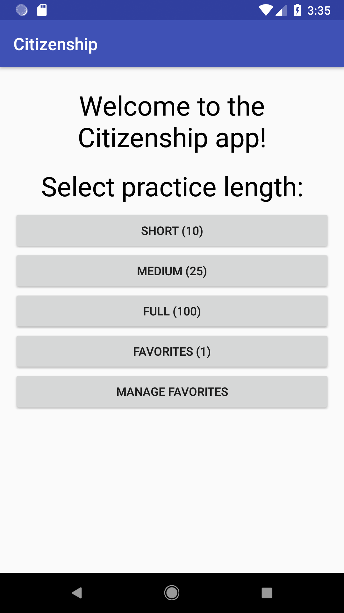
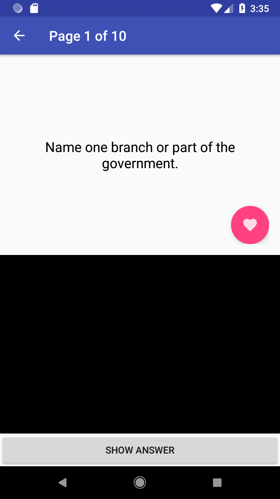
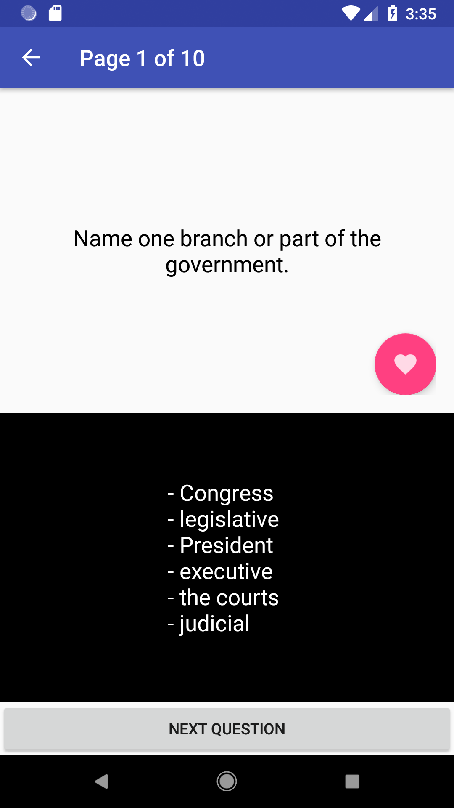
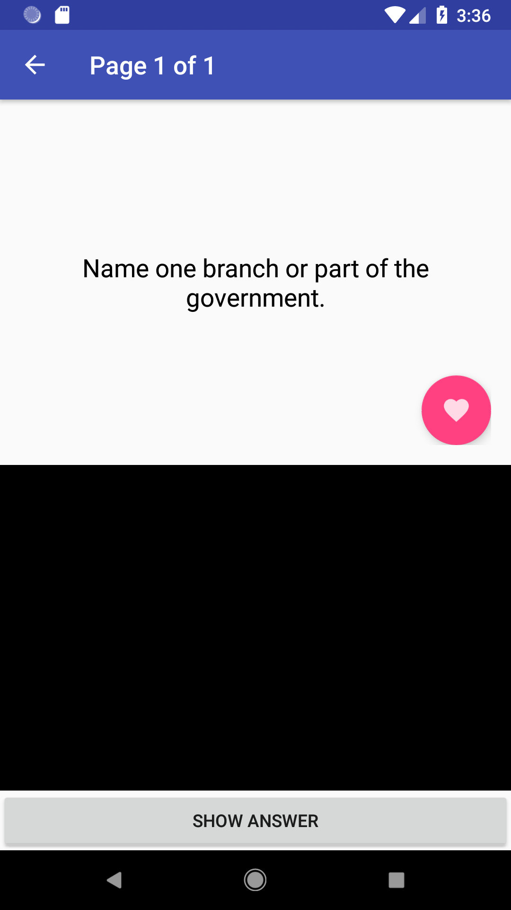
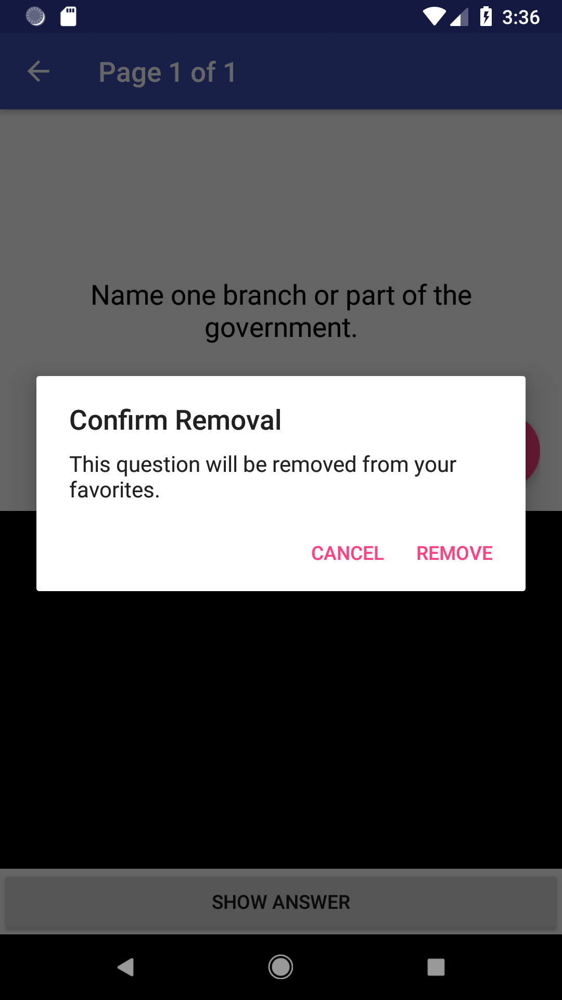
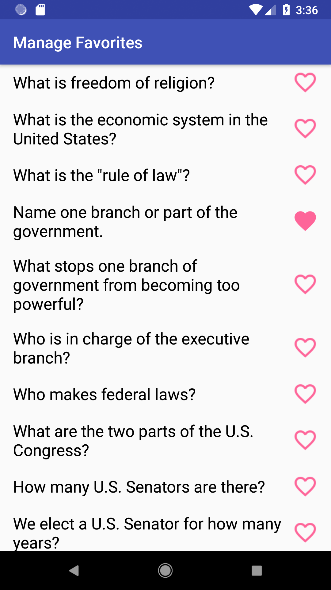

# Citizenship

## Introduction

This is an Android app to help the user study for the US Citizenship test. (Note that the answers to some questions are specific to Michigan or Michigan's 11th Congressional District.)

Upon starting the app, the user can choose to practice a fixed number of questions, practice favorite questions only, or manage their list of favorite questions.

| Starting Screen |
|:---------------:|
|  |

## Fixed Length Practices

The user can choose a short (10 questions), medium (25 questions), or full (all 100 questions) practice. The questions are randomly selected (10 and 25 questions) or in random order (100 questions). 

Each question appears as a flashcard. Initially, the answer is not shown. Pressing "Show Answer" will display the answer and allow the user to move on to the next question.

| Flashcard No Answer | Flashcard Answer |
|:-------------------:|:----------------:|
|  |  |

In this example of a short practice, the user has selected this question as a favorite by pressing the heart button.

## Favorites Practices

This example shows a favorites practice. The user can remove a question from the list of favorites by pressing the heart button. 

| Flashcard | Remove Flashcard |
|:---------:|:----------------:|
|  |  |

## Manage Favorites

The user can also manage their favorite questions directly through by selecting "Manage Favorites" on the starting screen. 

| Manage Favorites |
|:---------------:|
|  |

